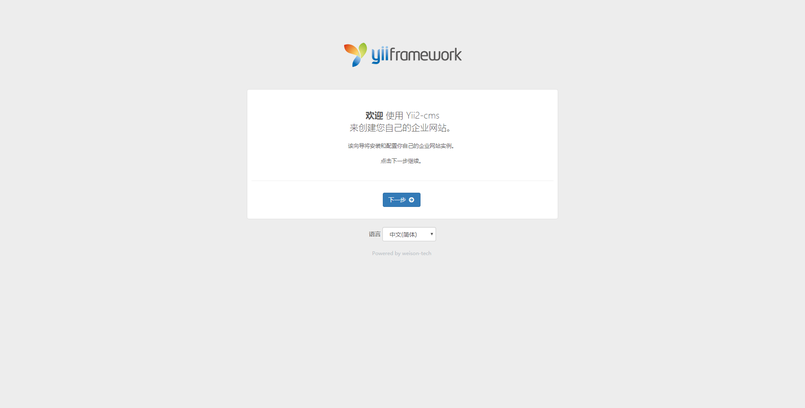
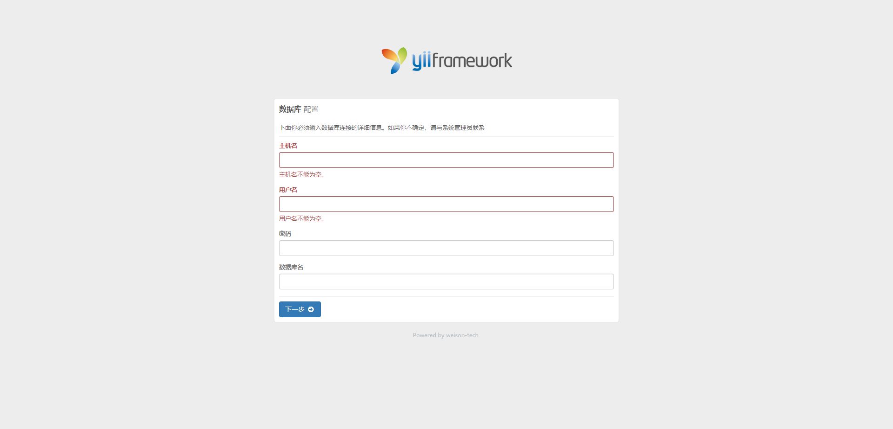
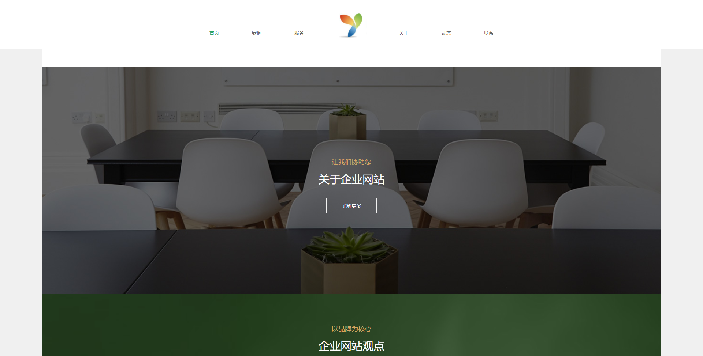
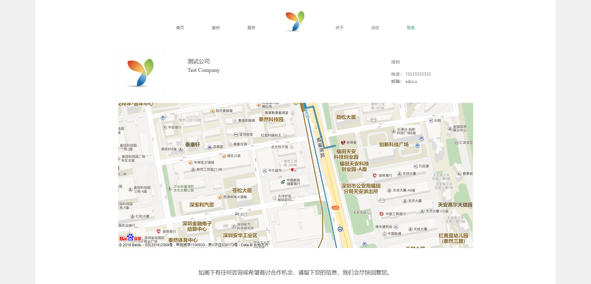
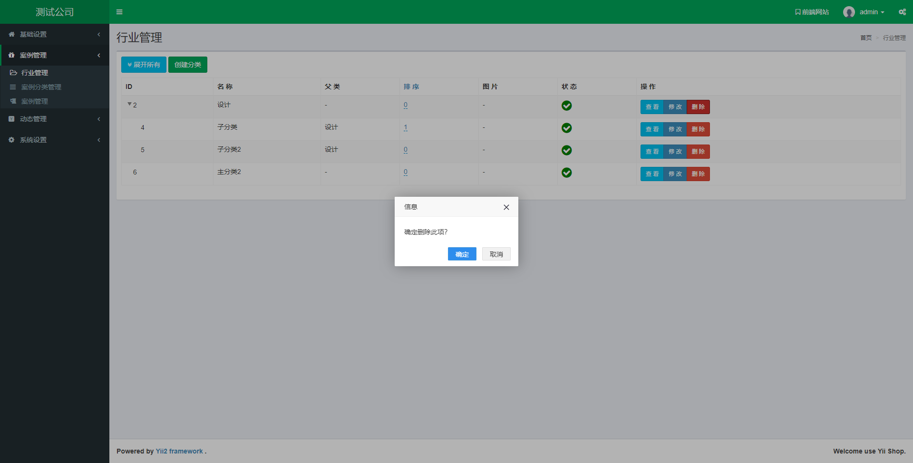
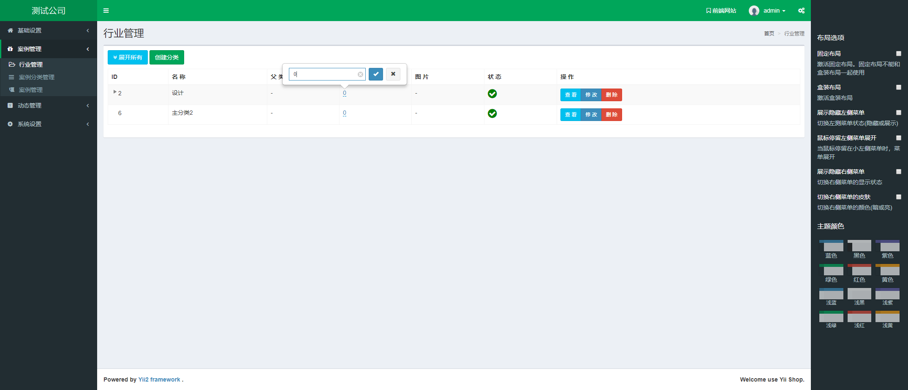
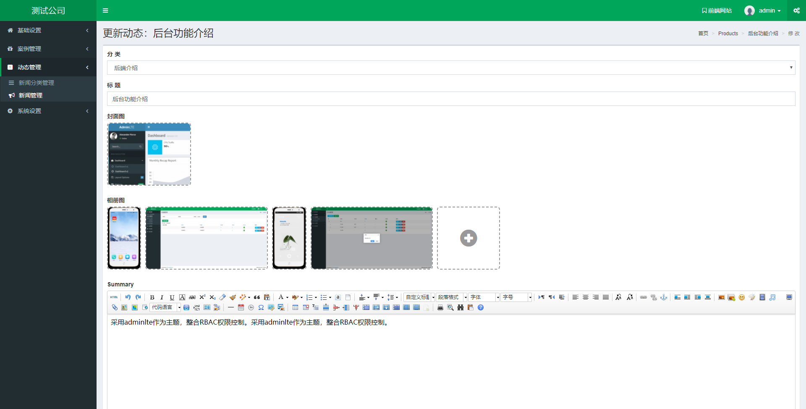
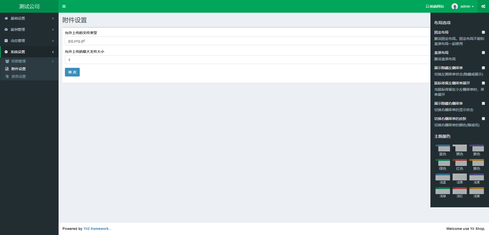
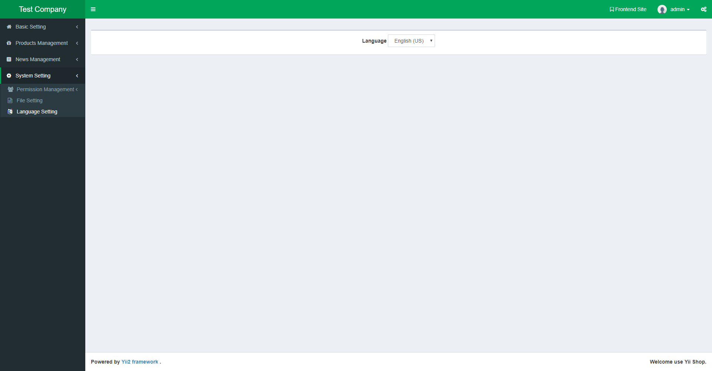
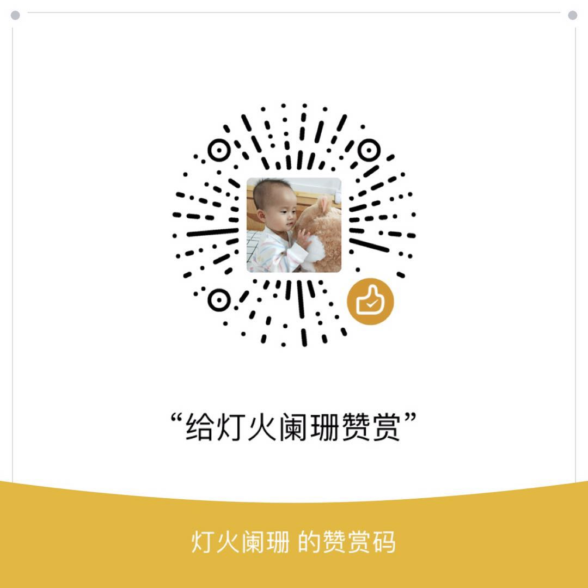

Yii2 CMS
===================================
This is a cms based on yii2 basic template, you can use it to build you own enterprise web site.


Directory structure
--------

```
assets                   contains all assets files published by Yii2 assetsManager, like js, css, font file and so on.    
protected
    core/
        commands/        contains all commands.
        components/      contains all common components.
        config/          contains all config files.
        libs/            contains common helpers.
        messages/        contains common translation files.
        migrations/      contains common migration files.
        model/           contains common models.
        modules/         contains all core module, such as admin, file, installer module and so on.
        widgets/         contains all common widgets.
    modules/             contains all custom created modules.
    runtime/             contains all runtime files generated by application.
    vendor/              contains all components and extenstions created by composer.
static                        
    css/                 contains some css.
    img/                 contains some img.
    js/                  contains some js.
themes                   
    default/             contains application default themes.
tools/                  
    gulp/                contains js and css compress tool gulp.
uploads/                 contains all upload files.
```

[中文文档](https://github.com/weison-tech/yii2-cms/blob/master/docs/README-zh.md)

Installation
--------
1, Update composer asset plugin.
```
$ composer global require "fxp/composer-asset-plugin:*"
```
2, Install yii2 cms code.
```
$ composer create-project --prefer-dist weison-tech/yii2-cms cms
```
3, Create database

4, Config you virtual host so that you can visit you site.

5, According to the installation wizard step by step installation.

6, If you use application in product environment, please change the index.php who stored in root folder.
when in product environment,you can compress all js and css file to one file.

Js and css compress
-------
1, First of all, you should install node js in your computer environment.

2, Install dependencies for this application.
```
$ cd tools/gulp
$ npm install
```
3, Use yii2 asset command to compress.
```
$ cd protected
$ php yii asset core/config/asset.php core/config/assets-prod.php
```
4, Update you application index file to production environment.

5, Enter the management background configuration permissions


Features
-------

1. Adminlte template for admin theme. 
2. RBAC management
3. I18N
4. News management system
5. Products management system

    ...


Preview
---------
Install





Frontend home page



Contact page



Use adminlte as theme, use layerui to define alert, category tree can fold.



Inline editable



Multiple image upload，Drag and drop sort



Change theme



Change language




Contact
--------
Wechat qrcode


Donate
--------
If you want help author to buy pizzas.

Wechat Reward Code



